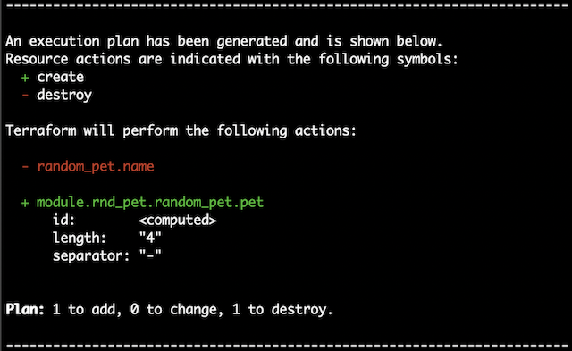
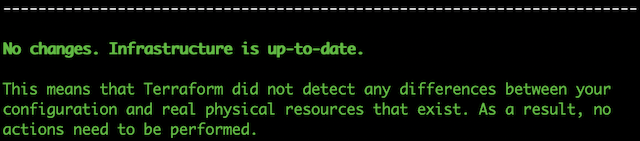

# Terraform move state

The purpose is to show how a terraform configuration can be refactored as a module without this causing recreation of the existing resources.

To demonstrate this we will start with a configuration that creates two resources:

```HCL
// This is not a working code but an example

// Creates a resource which we will move later
resource "random_pet" "name" {}

resource "null_resource" "hello" {
  // uses ${random_pet.name.id}
}
```

The next step is to refactor the configuration as a module. This means replacing the definition of the random_pet resource with the definition of a module that creates a random_pet resource.

In terraform modules are blocks of reusable code. They take input, manage resources based on it and then usually output data about the resources. More information about terraform modules can be found [here](https://www.terraform.io/docs/modules/index.html).

The main advantages of using modules are that they allow to reuse code between deferent projects or make sure to use the same code between the environments of a single project (e.g. production, staging, qa)

The refactored configuration would look like:

```HCL
// Again not actual code but an example

// Replace the random_pet with a module which creates a random_pet
module "rnd_pet" {}

// the null_resource now refers to the module
resource "null_resource" "hello" {
  // uses ${module.rnd_pet.pet_id}
}
```

and the module configuration would be like:

```HCL
// Again not actual code but an example

// Define variables to use as input
variable "pet_name_length" {}

// Create the random_pet resource
resource "random_pet" "pet" {
    // uses input variables
    length = "${var.pet_name_length}"
}

// Define output
output "pet_id" {
  // map the output to a managed resource property
  value = "${random_pet.pet.id}"
}
```

Since the random_pet definition from the initial configuration was replaced by a module definition terraform will destroy the removed random_pet resource and create a new module resource.

In some cases we may need to keep the existing resources instead of recreating them in the newly defined module.

To keep the existing random_pet resource we need to move it to the module in the terraform state. When this is done terraform will consider it as a resource created by the module.

To see an example of the described process please run the demonstration project as described below.

## Prerequisites

* Install Terraform - [instructions](https://www.terraform.io/intro/getting-started/install.html#installing-terraform)

## Running the demonstration

### Step 1 - Apply the initial Terraform configuration

* Copy the configuration to the current directory - `cp tf-config-initial/main.tf .`
* Initialize Terraform - `terraform init`
* Apply the configuration - `terraform apply`

At this point Terraform has created a random_pet and a null_resource.

### Step 2 - Refactor the configuration to use a module for the random_pet resource

* Copy the refactored configuration - `cp tf-config-module/main.tf .`
* Get the module - `terraform get`

At this point applying the terraform configuration will result in destruction of the random_pet resource created in step 1 and creation of a new random_pet via the module used in the refactored configuration.

To verify this run `terraform plan` . The result should look like:



### Step 3 - Move the random_pet to the module

To avoid the random_pet recreation we need to move the existing resource to the module in the terraform state.

Run - `terraform state mv random_pet.name module.rnd_pet.random_pet.pet`

Run - `terraform plan` to verify that no changes will be made if the refactored configuration is applied.

The result should look like:



Run - `terraform destroy` and both resources will be destroyed.